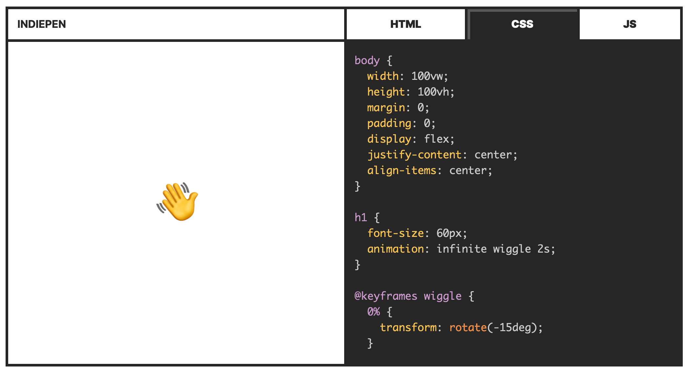

# Indiepen 📝

 &nbsp;
 &nbsp;

An independent and privacy-friendly solution to present your HTML, CSS and JS code example to the people.

👉 [Get started](https://indiepen.tech#get-started)

## Features 🤩

- Fun: Embed your HTML, CSS and JS code examples with ease
- Fair: No cookies, no tracking, no external requests
- Fast: Small footprint with less than 20 KB
- Inclusive: Features built for everyone
- Transparent: Open-source software

## Contributing 🤓

Did you find a bug? Do you have an idea to make Indiepen better? Cool, we would love to see your contribution. Feel free to create an issue or open a pull request. We wrote a small [guide](CONTRIBUTING.md), so it's easier for you to work on the project.

## License 👩‍⚖️

Just a simple [MIT license](LICENSE). 🤷
